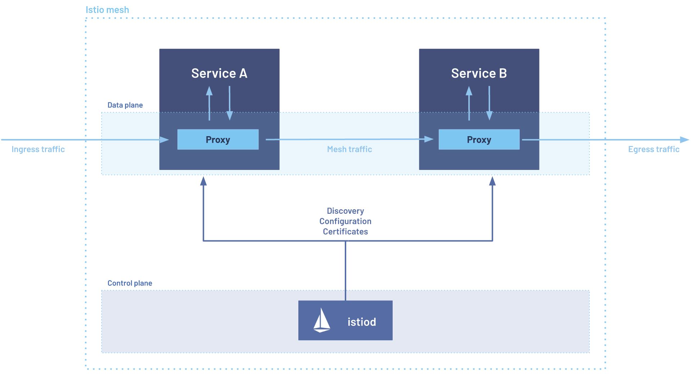

# How To Optimize Resources and Performance For Istio Proxy

Istio is a powerful service mesh that provides advanced traffic management, security, and observability features
for Kubernetes applications.
When starting with Istio, one of the most common challenges teams face
is optimizing the resource usage and performance of the Istio Proxy (Envoy) sidecars and Ingress Gateway.

In this post, you'll learn how Istio Proxy works, what factors impact its resource consumption, and how to
tune CPU, memory, and concurrency settings for both Ingress Gateway and sidecars.

Whether you're new to Istio or looking to fine-tune your existing setup, this guide provides
practical examples and best practices to help you get the most out of Istio in your environment.

{/* truncate */}

Before diving into optimization, it's important to understand the basic architecture of Istio and how the
Istio Proxy fits into it.
If you have some experience with Istio, feel free to skip next section.

## Understanding Istio Architecture

Istio is a popular open-source service mesh that helps manage microservices traffic, security, and
observability.
Its architecture is divided into two main components:

**Control Plane**: This includes the **_Istiod_** pod and configuration resources that can be found in the
istio-system namespace.
The control plane handles configuration management, certificate rotation, and
pushes user-defined configurations (like Virtual Services and Destination Rules) to the data plane.

**Data Plane**: This consists of sidecar containers (proxies) injected into application pods.
These proxies
are based on the Envoy proxy and are often referred to as **_Istio Proxy_**, **_Envoy Proxy_**, or simply
**_Sidecar_**.
They enforce the configurations from the control plane and enable features like traffic
management, security policies, and observability.



_Note: The image above shows a typical data plane setup, where each pod contains both a microservice
container and an Istio Proxy sidecar.
The Ingress Gateway pod is an exception, as it usually contains only
the Istio Proxy container to handle incoming traffic._

## Istio Data Plane Performance and Scalability

While Istio offers powerful capabilities to developers, tuning its resource usage can be quite complex. The most difficult
part of running Istio in large production environments, in my opinion, is optimizing the memory usage.

According to the
[Istio documentation](https://istio.io/latest/docs/ops/deployment/performance-and-scalability/#sidecar-and-ztunnel-resource-usage),
a typical Istio Proxy consumes:

- **CPU**: About 0.5 vCPU per 1000 requests per second
- **Memory**: Around 50 MB, though this can increase depending on the complexity of the configuration
  (such as the number of Virtual Services, Destination Rules, etc.)

As noted in the documentation, these numbers can vary significantly due to several factors, including:

- The size of requests and responses
- The number of CPU cores allocated to the proxy
- The protocols used (HTTP, gRPC, TCP, etc.)
- The number of configuration objects each proxy holds (injected from VirtualService, DestinationRule, and ServiceEntry).
  The more configuration the proxy has to handle, the more memory it will consume.
- Whether telemetry and monitoring filters are enabled

In the next sections, you'll learn how to optimize resource usage for both the Istio Ingress Gateway and sidecar proxies.
These optimizations can be considered as a starting point that you can further adjust based on your specific workload
and traffic patterns.

## Optimizing Memory Usage for Istio Ingress Gateway

When adopting Istio, cluster administrators often choose one of these two approaches for the Ingress Gateway:

- **Shared Ingress Gateway:** serves workloads across different namespaces at once
  (usually, there is one Ingress Gateway per environment - dev, staging, production)
- **Dedicated Ingress Gateways:** each namespace has its own Ingress Gateway, which is only responsible for serving the workloads
  in that namespace, this is a common approach for multi-tenant clusters.

Whether you have a shared or dedicated Ingress Gateway, the first thing to check is the presence of the environment variable
named
[`PILOT_FILTER_GATEWAY_CLUSTER_CONFIG`](https://istio.io/latest/docs/reference/commands/pilot-agent/#pilot-filter-gateway-cluster-config)
in Istiod.

If this variable is not present or set to `false`, each Ingress Gateway will receive configurations for all Virtual Services defined
in the cluster, even those that are not relevant to the workloads served by that Ingress Gateway.
This can lead to a large amount of useless configuration being pushed to the proxy, which can subsequently lead to increased memory
consumption, especially in larger clusters with many services and complex routing configurations.

Setting this environment variable explicitly to `true` allows the Ingress Gateway to only receive configurations relevant to the
workloads it serves, which can significantly reduce the memory usage.

```bash
PILOT_FILTER_GATEWAY_CLUSTER_CONFIG=true
```

You can compare the before-and-after by running the following command to see how many clusters the Ingress Gateway is
configured to handle:

```bash
istioctl proxy-config clusters <ingress-gateway-pod-name> -n <namespace>
```

After setting `PILOT_FILTER_GATEWAY_CLUSTER_CONFIG=true` variable (and restarting your Ingress Gateway pod),
you should see a significant reduction in the number of clusters.

```bash
# example, sanitized output
$ istioctl proxy-config clusters ingressgateway-abc -n istio-system
CLUSTER                                                   TYPE
outbound|80||service-a.default.svc.cluster.local           EDS
outbound|80||service-b.default.svc.cluster.local           EDS
# ...
```

Once the pilot is configured to filter the configuration for the Ingress Gateway, we can start optimizing the resource usage
of the proxy itself.

When configuring the Istio Ingress Gateway, it's important to assign appropriate CPU and memory resources.
Since the Ingress Gateway pod typically contains only the Istio Proxy container, all assigned resources are
dedicated to it.

For example:

```yaml
resources:
  requests:
    memory: "128Mi"
    cpu: "300m"
  limits:
    memory: "256Mi"
    cpu: "1000m"
```

The most important aspect to consider when optimizing the Ingress Gateway is the CPU limit.

Pay special attention to the `limits.cpu` value.
Setting this as a multiple of 1000 (e.g., 1000m = 1 vCPU,
2000m = 2 vCPUs) allows you to optimize the `concurrency` setting for the Istio Proxy.
The `concurrency`
parameter controls how many requests the proxy can handle concurrently.
Misconfiguring this parameter can
increase memory usage and may lead to OOM kills.

You can verify the `concurrency` parameter by running the following command inside the Ingress Gateway container:

```bash
curl localhost:15000/server_info | grep concurrency
```

Generally, you must ensure that the `concurrency` value is less than or equal to the CPU limit (in vCPUs) assigned to the proxy.
For example, if you set a CPU limit of 2000m (2 vCPUs), you can set concurrency to 1 or 2.

**Concurrency Rule:**

```math
concurrency\le istio\_proxy\_cpu\_limit\;
```

```math
concurrency \in \{1,2,3,\dots\}, \quad istio\_proxy\_cpu\_limit =
\begin{cases}
1 & \text{if CPULimit is } 1000m, \\
2 & \text{if CPULimit is } 2000m, \\
3 & \text{if CPULimit is } 3000m, \\
\vdots
\end{cases}
```

To modify the `concurrency` value, you can define a `ProxyConfig` object for the Ingress Gateway.

```yaml
apiVersion: networking.istio.io/v1beta1
kind: ProxyConfig
metadata:
  name: proxyconfig-ingressgateway
  namespace: <namespace>
spec:
  selector:
    matchLabels:
      app: ingressgateway
  concurrency: 1
```

After completing these optimizations you should see a significant improvement in memory usage of the Ingress Gateway.

## Optimizing Memory Usage for Istio-Proxy Sidecar

Similar to what we saw earlier in the Ingress Gateway section, sidecar proxies by default store the configuration of Virtual
Services, Destination Rules, and Service Entries for all workloads in the cluster, including those not served by that proxy.
Istio helps address this problem with the `Sidecar` resource, which can be enabled globally, per-namespace, or
for individual workloads. At this point, for those wondering, the `Sidecar` resource unfortunately does not apply to Ingress Gateways
as it is designed specifically for sidecar proxies; in this case, the Ingress Gateway is treated a special proxy, and it is not affected
by the `Sidecar` resource.

If you are running a multi-tenant cluster, where each namespace is virtually independent and serves different applications,
it's recommended to enable the `Sidecar` resource at the namespace level, like in the example below:

```yaml
apiVersion: networking.istio.io/v1
kind: Sidecar
metadata:
  name: default
  namespace: <namespace>
spec:
  egress:
    - hosts:
        - "./*"
        - "istio-system/*"
```

The configuration above ensures that the sidecar proxy only receives egress configuration for services in its own namespace and
the `istio-system` namespace, avoiding receiving configuration for services in other namespaces that it doesn't need to handle.

If you are running a global mesh, where workloads in different namespaces can communicate with each other,
you can still use the `Sidecar` resource.
You may configure it to only receive configurations relevant to the
services/namespaces it serves, for example:

```yaml
apiVersion: networking.istio.io/v1
kind: Sidecar
metadata:
  name: default
  namespace: <namespace>
spec:
  egress:
    - hosts:
        - "prod-namespace-1/*"
        - "prod-namespace-2/*"
        - "istio-system/*"
```

You can even be more specific and define the `Sidecar` resource at the workload level, using selectors to match specific deployments,
for example:

```yaml
apiVersion: networking.istio.io/v1
kind: Sidecar
metadata:
  name: order-sidecar
  namespace: <namespace>
spec:
  workloadSelector:
    labels:
      app: order
  egress:
    - hosts:
        - "prod-namespace-3/*"
        - "istio-system/*"
```

Whether you choose to configure the `Sidecar` resource at the namespace or workload level,
you can verify the configuration received by the proxy by running the following command
(before and after applying the `Sidecar` resource):

```bash
# example, sanitized output
$ istioctl proxy-config clusters order-app -c istio-proxy -n my-namespace
CLUSTER                                                   TYPE
outbound|80||service-a.products.svc.cluster.local          EDS
outbound|80||service-b.logistics.svc.cluster.local         EDS
# ...
```

Using the `Sidecar` resource to limit the configuration received by each proxy can significantly reduce memory usage and improve
performance, especially in larger clusters with many services and complex configurations.
Configuring Sidecar, needs to be done
carefully, as it can lead to unintended consequences if not properly set up.
For example setting a `Sidecar` resource in istio-system
namespace lead to a global configuration for all the proxies in the mesh, setting at namespace level overrides the global configuration
for all the proxies in that namespace, and setting it at workload level overrides both the global and namespace configuration for that
specific workload.
Read all combinations in the
[official Istio documentation](https://istio.io/latest/docs/reference/config/networking/sidecar/#:~:text=NOTE,proxies%2E).

Regarding resource allocation for sidecar proxies, CPU and memory values are often set globally in the Istio Control Plane.
You can find the default values in the ConfigMap named `istio-sidecar-injector` in the `istio-system` namespace.
Usually
the default values are:

```json
{
  "resources": {
    "limits": {
      "cpu": "1000m",
      "memory": "1024Mi"
    },
    "requests": {
      "cpu": "100m",
      "memory": "128Mi"
    }
  }
}
```

The global configuration will be injected into all sidecar proxies by default, but it can be overridden on a per-pod basis.
Many workloads work well with the default values, but for some workloads, especially those with high traffic or complex configurations,
you may need to adjust these settings to optimize performance and resource usage.

You can override these defaults using pod labels and annotations, such as:

- `sidecar.istio.io/proxyMemory`
- `sidecar.istio.io/proxyMemoryLimit`
- `sidecar.istio.io/proxyCPU`
- `sidecar.istio.io/proxyCPULimit`

:::note
In recent Istio versions, these values are only read from pod labels; annotations are ignored.
The example below includes
both labels and annotations for backward compatibility, but you can safely ignore the annotations in the latest versions of
Istio.
:::

Example:

```yaml
apiVersion: apps/v1
kind: Deployment
metadata:
  name: hello
  namespace: <namespace>
spec:
  replicas: 1
  selector:
    matchLabels:
      app: hello
  template:
    metadata:
      annotations:
        sidecar.istio.io/proxyCPULimit: "2000m"
        sidecar.istio.io/proxyMemoryLimit: "2048Mi"
      labels:
        sidecar.istio.io/proxyCPULimit: "2000m"
        sidecar.istio.io/proxyMemoryLimit: "2048Mi"
        app: hello
    spec:
      containers:
        - name: nginx
          image: nginx:1.7.9
          ports:
            - containerPort: 80
```

As with the Ingress Gateway, the `concurrency` parameter for sidecar proxies should also be set according to the CPU limit
assigned to the proxy.
The same guidelines explained in the previous section apply here as well.

The `CPULimit` value is the upper bound for optimal concurrency and should be a multiple of 1000 (1000m,
2000m, 3000m, etc.).

**Concurrency Rule:**

```math
concurrency\le istio\_proxy\_cpu\_limit\;
```

```math
concurrency \in \{1,2,3,\dots\}, \quad istio\_proxy\_cpu\_limit =
\begin{cases}
1 & \text{if CPULimit is } 1000m, \\
2 & \text{if CPULimit is } 2000m, \\
3 & \text{if CPULimit is } 3000m, \\
\vdots
\end{cases}
```

For workloads, you can set the concurrency value using either of these methods:

1. **ProxyConfig object**: Create a ProxyConfig for each workload, using selectors to match deployments.
2. **Annotations**: Use the `proxy.istio.io/config` annotation to set concurrency directly.

Example (ProxyConfig):

```yaml
apiVersion: networking.istio.io/v1beta1
kind: ProxyConfig
metadata:
  name: proxyconfig-example
  namespace: <namespace>
spec:
  selector:
    matchLabels:
      app: hello
  concurrency: 1
```

Example (Annotation):

```yaml
apiVersion: apps/v1
kind: Deployment
metadata:
  name: hello
  namespace: test
spec:
  replicas: 1
  selector:
    matchLabels:
      app: hello
  template:
    metadata:
      annotations:
        sidecar.istio.io/proxyCPULimit: "2000m"
        sidecar.istio.io/proxyMemoryLimit: "2048Mi"
        proxy.istio.io/config: |
          concurrency: 2
      labels:
        sidecar.istio.io/proxyCPULimit: "2000m"
        sidecar.istio.io/proxyMemoryLimit: "2048Mi"
        app: hello
    spec:
      containers:
        - name: nginx
          image: nginx:1.7.9
          ports:
            - containerPort: 80
```

In both cases, you can verify the concurrency value by running the same command we used for the Ingress Gateway,
but this time inside the sidecar proxy container:

```bash
curl localhost:15000/server_info | grep concurrency
```

After completing these optimizations you should see a significant improvement in memory usage of the Istio Proxy sidecar.

## Optimizing Scalability of Pods Using Istio Proxy

When optimizing pod scalability with Istio sidecars, it's important to consider that each pod now
contains at least two containers: the application container and the Istio Proxy sidecar.
This affects how
Kubernetes Horizontal Pod Autoscaler (HPA) metrics are calculated.

When running multi-container pods, users often forget that HPA metrics are calculated from the average usage across
all containers.
The default behavior of HPA is as follows:

1. **Single-container pod:** HPA triggers scaling when the CPU or memory usage of the container exceeds the target.
2. **Multi-container pod:** HPA triggers scaling based on the average usage across all containers in the pod.

When adopting Istio (but this is also true for any multi-container pod), HPA should consider the two containers separately,
the pod as a whole should scale if either the application container or the proxy container exceeds its respective target.

The following example outlines a common mistake when configuring HPA for a pod with an Istio Proxy sidecar.
This HPA
scales the pod based on the average CPU usage across both the application and the proxy containers.

**Example of a basic (not recommended) HPA:**

```yaml
apiVersion: autoscaling/v2
kind: HorizontalPodAutoscaler
metadata:
  name: hello-hpa
spec:
  scaleTargetRef:
    apiVersion: apps/v1
    kind: Deployment
    name: hello
  minReplicas: 1
  maxReplicas: 10
  metrics:
    - type: Resource
      resource:
        name: cpu
        target:
          type: Utilization
          averageUtilization: 50
```

**Recommended approach:**

Instead, it is recommended to define separate scaling targets for the application and the Istio Proxy containers.
For example, you might set a CPU target for the proxy (e.g., 50-60%) and both CPU and memory targets for the application container.
This HPA configuration leverages
[ContainerResourceMetrics](https://kubernetes.io/docs/concepts/workloads/autoscaling/horizontal-pod-autoscale/#container-resource-metrics)

```yaml
apiVersion: autoscaling/v2
kind: HorizontalPodAutoscaler
metadata:
  name: moon-hpa
spec:
  scaleTargetRef:
    apiVersion: apps/v1
    kind: Deployment
    name: order-moon
  minReplicas: 1
  maxReplicas: 10
  behavior:
    scaleDown:
      policies:
        - type: Pods
          value: 1
          periodSeconds: 300
  metrics:
    # Istio-Proxy scaled based on CPU usage
    - type: ContainerResource
      containerResource:
        name: cpu
        container: istio-proxy
        target:
          type: Utilization
          averageUtilization: 50
    # Application container scaled based on CPU and Memory usage
    - type: ContainerResource
      containerResource:
        name: cpu
        container: order
        target:
          type: Utilization
          averageUtilization: 70
    - type: ContainerResource
      containerResource:
        name: memory
        container: order
        target:
          type: Utilization
          averageUtilization: 70
```

With this setup, the pod will scale if either the application or the proxy container exceeds its respective target.

## Conclusion

In this post, you learned how to optimize resource usage and performance for Istio Proxy in both Ingress Gateway and
sidecar configurations.
This is a crucial aspect of running Istio efficiently in production.

While this guide provided a starting point for optimization, it's important to continuously monitor and adjust these
settings based on your specific workload and traffic patterns.
Resources should be validated with load testing
and performance monitoring to ensure that your Istio deployment remains efficient and responsive as your application
evolves over time.
